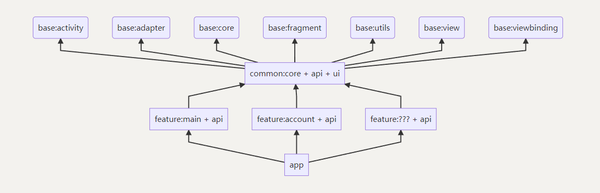
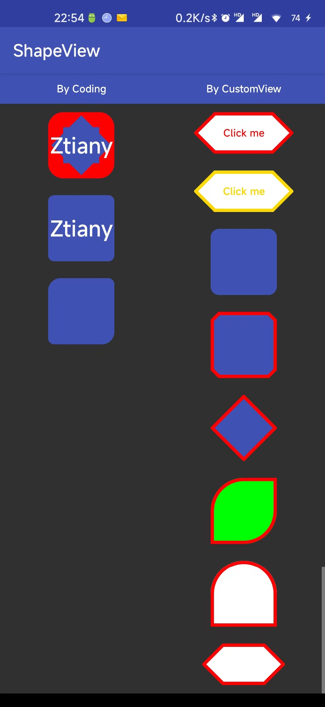
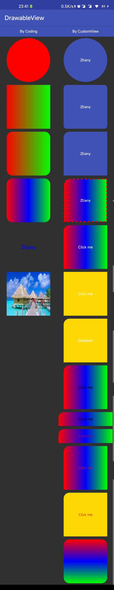

# Android Architecture Practice

[](https://developer.android.com/)
[](https://kotlinlang.org/)
[](https://developer.android.com/studio)
[](LICENSE)

An **enterprise-grade Android architecture practice project** demonstrating Clean Architecture with modularization. This project serves as a comprehensive reference for building scalable, maintainable Android applications using modern Android development practices.

## 🎯 Project Goals

- **Demonstrate Clean Architecture** with clear separation of concerns (Presentation/Domain/Data layers)
- **Showcase modularization** patterns for large-scale Android applications
- **Provide production-ready code** with MVVM, Hilt DI, Coroutines, and Flow
- **Reference implementation** for networking, storage, state management, and UI patterns

## ✨ Key Features

- 🏗️ **Modular Architecture**: Base, Common, Component, and Feature modules with clear dependencies
- 💉 **Hilt Dependency Injection**: Complete DI setup from presentation to data layers
- 🌐 **Robust Networking**: Retrofit + OkHttp with ServiceContext wrapper for API calls
- 💾 **Flexible Storage**: StorageManager abstraction supporting SharedPreferences and MMKV
- 🔄 **State Management**: StateD pattern with LiveData and Flow support
- 🎨 **Custom UI Components**: ShapeableView and DView for drawable-less UI
- 🧩 **API-First Design**: Features expose capabilities through API modules, not implementations
- 📱 **View & Compose**: Support for both traditional View system and Jetpack Compose

## 📋 Table of Contents

- [Quick Start](#quick-start)
- [Architecture Overview](#architecture-overview)
- [Module Structure](#module-structure)
- [Core Capabilities](#core-capabilities)
- [State Management](#state-management)
- [UI Components](#ui-components)
- [Development Guidelines](#development-guidelines)
- [Build System](#build-system)
- [Contributing](#contributing)

## 🚀 Quick Start

### Prerequisites

- **JDK**: 11 or higher
- **Android Studio**: Jellyfish (2023.3.1) or newer
- **Git**: For cloning and submodules

### Installation

```bash
# Clone the repository
git clone git@github.com:Ztiany/android-architecture-practice.git
cd android-architecture-practice

# Initialize and update submodules
git submodule init
git submodule update
```

### Building

```bash
# Build debug APK
./gradlew assembleDebug

# Build release APK
./gradlew assembleRelease

# Clean build
./gradlew clean

# Run tests
./gradlew test

# Run lint checks
./gradlew lint
```

### Troubleshooting Build Issues

**If build fails after pulling changes:**

Set `forceSubstitution = true` in `settings.gradle.kts` (line 45):

```kotlin
// In settings.gradle.kts
forceSubstitution = true  // Force use of local modules
```

**If Gradle daemon issues occur:**

```bash
# Stop daemon and retry
./gradlew --stop
./gradlew assembleDebug
```

### Publishing Base Modules

For module substitution development:

```bash
# Publish all base modules to MavenLocal
./gradlew publishAllBaseProjectToMavenLocal
```

## 🏗️ Architecture Overview

This project follows **Clean Architecture** principles with three main layers:

```
┌─────────────────────────────────────────┐
│       Presentation Layer (MVVM)         │
│  Fragments/Activities + ViewModels      │
│         State Management (LiveData/Flow) │
└─────────────────────────────────────────┘
                  ↓
┌─────────────────────────────────────────┐
│          Domain Layer                   │
│      Repositories + Use Cases           │
│         Business Logic Abstraction       │
└─────────────────────────────────────────┘
                  ↓
┌─────────────────────────────────────────┐
│           Data Layer                    │
│    Retrofit + OkHttp + Room + Storage   │
│        Data Sources & Persistence       │
└─────────────────────────────────────────┘
```

### Dependency Injection with Hilt

The entire project uses **Hilt** for dependency injection:
- **Presentation**: Fragments/Activities → ViewModels/Repositories
- **Inter-module**: Features depend on APIs through interfaces
- **Global DI container**: Manages object lifecycles

**Philosophy**: Activity and Fragment components shouldn't worry about creating ViewModels or Repositories. Instead, they declare dependencies, and the container (Hilt) provides them.

### API-First Feature Design

Each feature follows the **API-First Design** pattern:

```
feature/account/
├── api/          # Interfaces and capabilities exposed to other features
│   └── AccountApi.kt
├── main/         # Core implementation of the feature
│   ├── implementation/
│   ├── presentation/
│   └── domain/
└── app/          # (Optional) Feature-specific app module
```

**Golden Rule**: Features should only depend on:
- `base/*` modules
- `common/*` modules
- Other feature `:feature/*/api` modules (never `main`)

## 📦 Module Structure



### Base Modules (Business-Independent Foundation)

| Module | Purpose |
|--------|---------|
| `activity/` | Base Activity classes |
| `adapter/` | Adapter implementations |
| `core/` | Core utilities |
| `fragment/` | Base Fragment classes (core UI framework) |
| `utils/` | General utilities |
| `view/` | Custom views (ShapeableView, DView) |
| `viewbinding/` | ViewBinding utilities |

### Common Modules (Business-Common)

| Module | Purpose |
|--------|---------|
| `api/` | Common API interfaces |
| `core/` | Business core logic |
| `http/` | HTTP client & networking (Retrofit/OkHttp) |
| `ui-dialog/` | Dialog components |
| `ui-theme/` | Theme resources |
| `ui-widget/` | UI widgets |
| `ui-compose/` | Compose UI components |

### Component Modules (Reusable Components)

| Module | Purpose |
|--------|---------|
| `upgrade/` | App upgrade functionality |
| `selector/` | Media/file selector |
| `uitask/` | UI task manager (global UI task management) |

### Feature Modules (Business Features)

| Module | Purpose |
|--------|---------|
| `account/` | Account management (login, user info) |
| `home/` | Home feature (dashboard, tabs, navigation) |
| `browser/` | Browser feature |

## 💪 Core Capabilities

### 1. Network Requests

#### Define API Interface

```kotlin
interface AccountApi {
    @POST("novaAccountLogin")
    suspend fun pwdLogin(@Body loginRequest: LoginRequest): ApiResult<LoginResponse>
}
```

#### Provide with Hilt

```kotlin
@Module
@InstallIn(ActivityRetainedComponent::class)
object AccountInjectionModule {

    @Provides
    fun provideAccountApi(
        apiServiceFactoryProvider: ApiServiceFactoryProvider
    ): ServiceContext<AccountApi> {
        return apiServiceFactoryProvider.default.createServiceContext(AccountApi::class.java)
    }
}
```

#### Use in Repository

```kotlin
class AccountRepository @Inject constructor(
    private val accountApi: ServiceContext<AccountApi>,
    private val userManager: UserManager,
    private val dispatcherProvider: DispatcherProvider,
) {

    suspend fun pwdLogin(account: String, password: String): User {
        val loginRequest = LoginRequest(
            userAccount = account,
            pwd = password,
            validateCode = "",
            loginType = LOGIN_TYPE_NORMAL
        )

        val loginResponse = withContext(dispatcherProvider.io()) {
            accountApi.executeApiCall { pwdLogin(loginRequest) }
        }

        userManager.updateUser {
            it.copy(
                isFirstLogin = loginResponse.firstLoginFlag.isPositiveApiFlag(),
                merchantList = loginResponse.merInfoList.map { merchant ->
                    Merchant(
                        merchantId = merchant.merchantId,
                        merchantName = merchant.merchantName
                    )
                }
            )
        }

        return userManager.user
    }
}
```

#### ServiceContext Methods

```kotlin
// Returns CallResult for handling success/error
suspend fun <T : Any> apiCall(
    call: suspend Service.() -> Result<T>
): CallResult<T>

// Direct result, throws on failure
suspend fun <T : Any> executeApiCall(
    call: suspend Service.() -> Result<T>
): T

// Allows nullable data field
suspend fun <T : Any?> apiCallNullable(
    call: suspend Service.() -> Result<T>?
): CallResult<T?>

// With retry support
suspend fun <T : Any> apiCallRetry(
    retryDeterminer: RetryDeterminer,
    call: suspend Service.() -> Result<T>
): CallResult<T>
```

### 2. Data Storage

Using `StorageManager` for data persistence:

```kotlin
@Singleton
class UserManagerImpl @Inject constructor(
    @ApplicationScope private val coroutineScope: CoroutineScope,
    storageManager: StorageManager,
) : UserManager {

    private val userStorage = storageManager.newStorage("app_user_storage_id")

    init {
        val loadedUser = userStorage.getEntity("app_user_key") ?: User.NOT_LOGIN
        userFlow = MutableStateFlow(loadedUser)

        coroutineScope.launch {
            userFlow.onEach { user ->
                if (user != User.NOT_LOGIN) {
                    userStorage.putEntity("app_user_key", user)
                }
            }.collect()
        }
    }
}
```

#### Storage API

```kotlin
interface Storage {
    // Primitives
    fun putInt(key: String, value: Int)
    fun putLong(key: String, value: Long)
    fun putBoolean(key: String, value: Boolean)
    fun putString(key: String, value: String?)

    // Objects with JSON serialization
    fun putEntity(key: String, entity: Any?)
    fun putEntity(key: String, entity: Any?, cacheTime: Long)

    // Getters
    fun getInt(key: String, defaultValue: Int): Int
    fun getLong(key: String, defaultValue: Long): Long
    fun getBoolean(key: String, defaultValue: Boolean): Boolean
    fun getString(key: String): String?
    fun <T> getEntity(key: String, type: Type): T?

    // Removal
    fun remove(key: String)
    fun clearAll()
}
```

#### Storage Implementations

- **SharedPreferences**: Default implementation (recommended for user data)
- **MMKV**: Alternative high-performance implementation (⚠️ **Not recommended** for critical user data due to lack of backup mechanism)

### 3. Base Classes

#### BaseUIFragment

Basic UI capabilities with toast and dialog support:

```kotlin
class ComponentFragment : BaseUIFragment<SampleFragmentComponentBinding>() {

    override fun onSetUpCreatedView(view: View, savedInstanceState: Bundle?) = withVB {
        sampleTvDialogConfirm.onDebouncedClick {
            showConfirmDialog()
        }
    }

    private fun showConfirmDialog() {
        showConfirmDialog {
            message = "Confirm action"
            negativeText = "Cancel"
            positiveText = "Confirm"
            positiveListener = {
                // Handle confirmation
            }
            cancelableTouchOutside = false
        }
    }
}
```

#### BaseStateFragment

Multi-state layout support (loading/empty/error):

**Layout Requirements:**
- Must include `SimpleMultiStateLayout` with id `base_state_layout`
- Optional `ScrollChildSwipeRefreshLayout` with id `base_refresh_layout`

```xml
<com.android.base.fragment.widget.ScrollChildSwipeRefreshLayout
    style="@style/Widget.App.SwipeRefreshLayout">

    <com.android.base.fragment.widget.SimpleMultiStateLayout
        style="@style/Widget.App.SimpleMultiStateLayout">

        <androidx.recyclerview.widget.RecyclerView
            android:id="@id/recycler_view"
            android:layout_width="match_parent"
            android:layout_height="match_parent" />

    </com.android.base.fragment.widget.SimpleMultiStateLayout>

</com.android.base.fragment.widget.ScrollChildSwipeRefreshLayout>
```

#### BaseListFragment

List handling capabilities with adapter and pagination support.

## 🔄 State Management

### StateD Pattern

UI states are represented as `StateD` with three possible states:
- **Loading**: Request in progress
- **Error**: Request failed
- **Success**: Request succeeded (with or without data)

### Using LiveData

#### In ViewModel

```kotlin
@HiltViewModel
class PasswordLoginViewModel @Inject constructor(
    private val accountRepository: AccountRepository,
    private val appSettings: AppSettings,
) : ViewModel() {

    private val _loginState = MutableLiveData<StateD<User>>()
    val loginState: LiveData<StateD<User>> = _loginState

    fun smsLogin(phone: String, password: String) {
        _loginState.setLoading()

        viewModelScope.launch {
            try {
                val user = accountRepository.pwdLogin(phone, password)
                _loginState.setData(user)
                appSettings.agreeWithUserProtocol = true
            } catch (e: Exception) {
                ensureActive()
                _loginState.setError(e)
            }
        }
    }
}
```

#### In Fragment

```kotlin
@AndroidEntryPoint
class PasswordLoginFragment : BaseUIFragment<AccountFragmentPasswordBinding>() {

    private val viewModel: PasswordLoginViewModel by viewModels()

    override fun onCreate(savedInstanceState: Bundle?) {
        super.onCreate(savedInstanceState)
        subscribeViewModel()
    }

    private fun subscribeViewModel() {
        handleLiveData(viewModel.loginState) {
            onData { user ->
                // Success with data
                showMessage(R.string.login_success)
                navigator.exitAndToHomePage()
            }
        }
    }
}
```

#### ResourceHandlerBuilder API

```kotlin
handleLiveData(viewModel.loginState) {
    onLoading {
        // Called when state is Loading
    }
    onData { data ->
        // Called when state is Success with data
    }
    onNoData {
        // Called when state is Success without data
    }
    onError { error ->
        // Called when state is Error (event-based)
    }
    onErrorState { error ->
        // Called when state is Error (state-based)
    }

    // Configuration
    loadingMessage("Loading...")
    disableLoading()
    forceLoading()
}
```

### Using Flow

```kotlin
@AndroidEntryPoint
class PhonePreviewsFragment : BaseStateFragment<MainFragmentPhonePreviewsBinding>() {

    private val phoneViewModel by activityViewModels<PhoneViewModel>()

    override fun onViewPrepared(view: View, savedInstanceState: Bundle?) {
        subscribeViewModel()
    }

    private fun subscribeViewModel() {
        // Use handleFlowWithViewLifecycle for Flow
        handleFlowWithViewLifecycle(data = phoneViewModel.devicesState) {
            onData { devices ->
                // Handle success
            }
        }
    }
}
```

**Note**: This project doesn't enforce LiveData vs Flow. Choose based on your use case.

## 🎨 UI Components

### Custom Drawable System

This project extends [android-drawable-view](https://github.com/Ztiany/android-drawable-view) to create drawables via XML attributes instead of drawable XML files.

#### ShapeableView (No Gradient)

Basic shapes using XML attributes:

```xml
<com.app.base.view.view.ShapeableView
    android:layout_width="100dp"
    android:layout_height="100dp"
    app:shape_rectangle="true"
    app:shape_corner_radius="10dp"
    app:shape_solid_color="@color/primary" />
```



#### DView (With Gradient)

Advanced shapes with gradient support:

```xml
<com.app.base.view.view.DView
    android:layout_width="100dp"
    android:layout_height="100dp"
    app:d_shape_rectangle="true"
    app:d_corner_radius="10dp"
    app:d_gradient_start_color="@color/primary"
    app:d_gradient_end_color="@color/primaryDark" />
```



This approach eliminates the need for most drawable XML resources.

### Dialog Components

Simplified dialog API:

```kotlin
showConfirmDialog {
    message = "Confirm action"
    negativeText = "Cancel"
    positiveText = "Confirm"
    positiveListener = {
        // Handle confirmation
    }
    cancelableTouchOutside = false
}
```

## 📏 Development Guidelines

### Android Studio Settings

#### 1. Enable Auto-Import

**Settings → Editor → General → Auto Import**
- ✅ Check "Add unambiguous imports on the fly"
- ✅ Check "Optimize imports on the fly"

#### 2. Line Length and Wrapping

**Settings → Editor → Code Style → Kotlin**
- Set "Right margin" to your preference (recommended: 120-140)
- Configure wrapping rules for consistency

#### 3. XML Style

**Settings → Editor → Code Style → XML**
- Set line length and formatting rules
- Ensure consistent XML indentation

### Code Standards

1. **Format code before committing**
2. **Minimize visibility** (private → internal → public):
   - Keep module-private code within the module
   - Only truly shared code goes to common modules
   - Use the most restrictive visibility possible

### Resource Conventions

#### 1. Resource Placement

- **Images**: Place in `drawable/` (not `mipmap/`, except launcher icons)
- **Icons**: Use `xxhdpi` for icon resources
- **Module resources**: Keep module-private resources in the module
- **Common resources**: Place shared resources in common modules

#### 2. Resource Prefixes

Each module has a **unique resource prefix** (configured in `build.gradle.kts`). All resources must start with that prefix.

**Examples**:
- `home_` for home feature
- `account_` for account feature
- `common_` for common modules

**This includes Styles, IDs, Strings, and all other resource types.**

### Adding a New Feature

#### Using Feature Generator (Windows)

```bash
cd scripts
./feature_generator.exe feature_name="new_feature" target_path="../feature/new_feature/"
```

#### Manual Creation

1. Create `feature/new_feature/api/` for interfaces
2. Create `feature/new_feature/main/` for implementation
3. Add includes to `settings.gradle.kts`

## 🔧 Build System

### Gradle Configuration

- **AGP**: 8.3.2
- **Kotlin**: 1.9.24
- **JDK**: 11
- **Version Catalog**: `gradle/libs.versions.toml`

### Custom Gradle Plugins

Located in `plugins/convention/src/main/kotlin/com/android/app/build/`:

- `ModularizationApplicationPlugin`: For application modules
- `ModularizationLibraryPlugin`: For library modules
- `ModularizationAPIPlugin`: For API modules (feature interfaces)
- `CommonLibraryPlugin`: For common library setup
- `ComposeFeaturePlugin`: For Compose feature modules
- `FinalApplicationPlugin`: For final app configuration

### Module Substitution System

The project supports switching between local and remote modules via `settings.project.json`:

- **Controlled by**: `DependencySubstitutionPlugin` in `settings.gradle.kts`
- **forceSubstitution = true**: Forces use of local modules
- **useLocal: true**: Per-module control
- **Purpose**: Enables development with local base modules while using published artifacts for others

### Non-Transitive R Class

Android Gradle Plugin 8.0+ enables `nonTransitiveRClass` by default:
- A module referencing another module's resources **must use fully qualified names**
- Example: `R.string.home_title` instead of `R.string.title`

### Namespace

Android Gradle Plugin 8.0+ uses `namespace` in `build.gradle.kts`:
- No need to specify `package` in `AndroidManifest.xml`
- The `namespace` defines the R file's package name

## 🤝 Contributing

Contributions are welcome! Please follow these guidelines:

### Code Review Process

1. Fork the repository
2. Create a feature branch (`git checkout -b feature/amazing-feature`)
3. Format your code
4. Commit your changes (follow commit message conventions)
5. Push to the branch (`git push origin feature/amazing-feature`)
6. Open a Pull Request

### Commit Message Guidelines

- Use clear, descriptive commit messages
- Start with a verb: `feat:`, `fix:`, `docs:`, `refactor:`, `test:`, `chore:`
- Example: `feat(account): add biometric login support`

### Code Style

- Follow existing code patterns and architecture
- Maintain consistency with surrounding code
- Add comments for complex logic
- Update documentation as needed

## 📚 Additional Resources

### Documentation

- **[Coding Standards](./document/coding-standards.md)**: Code style and conventions (Chinese)
- **[Glossary](./document/glossary.md)**: Project terminology and definitions (English)

### Sample Modules

- **[sample/tradition](./sample/tradition)**: View-based implementation examples
- **[sample/compose](./sample/compose)**: Compose-based implementation examples

## 📝 License

```
Copyright 2024 Ztiany

Licensed under the Apache License, Version 2.0 (the "License");
you may not use this file except in compliance with the License.
You may obtain a copy of the License at

    http://www.apache.org/licenses/LICENSE-2.0

Unless required by applicable law or agreed to in writing, software
distributed under the License is distributed on an "AS IS" BASIS,
WITHOUT WARRANTIES OR CONDITIONS OF ANY KIND, either express or implied.
See the License for the specific language governing permissions and
limitations under the License.
```

## 🙏 Acknowledgments

This project demonstrates modern Android development practices and serves as a reference for building scalable Android applications. Special thanks to the Android developer community for the amazing tools and libraries that make this architecture possible.

---

**Made with ❤️ by [Ztiany](https://github.com/Ztiany)**
