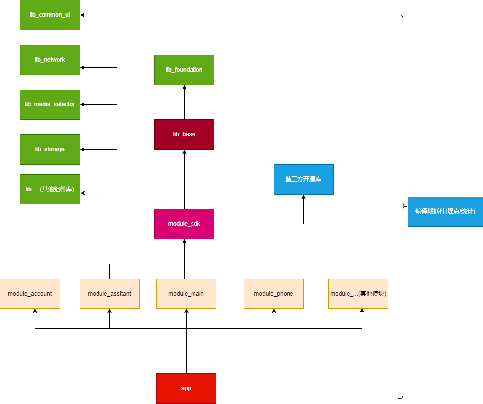
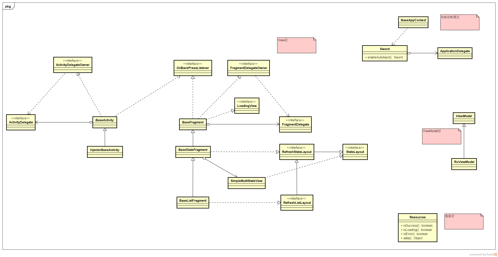
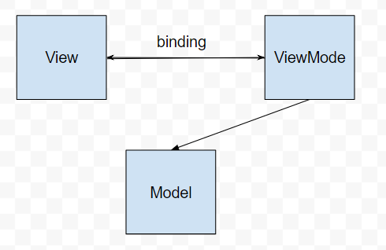
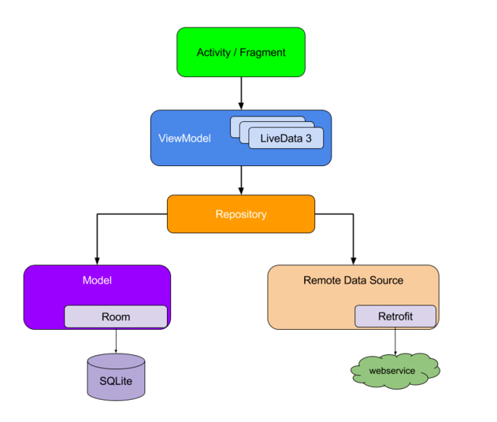
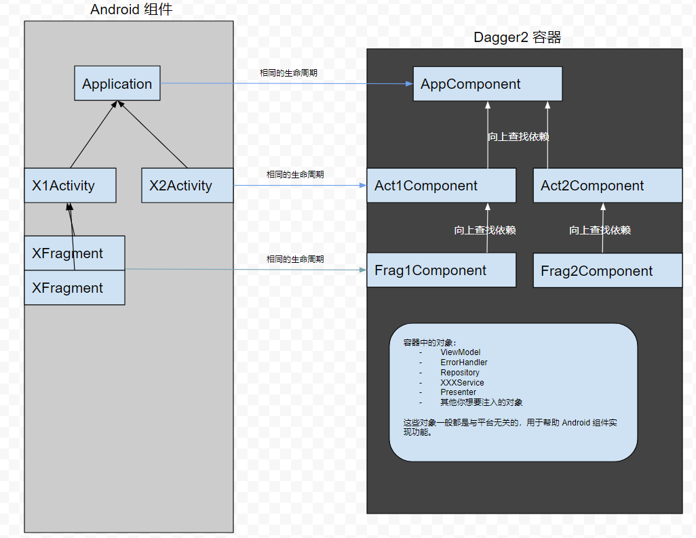

# 瑞驰 Android 云手机客户端框架说明

[TOC]

---

## 1 整体设计

### 1.1 组件划分

APP 整体上采用组件化进行开发，组件化架构特点如下：

- 组件之间是相互隔离的，只能通过路由框架进行通信。
- 不同层级之间的依赖关系是单向的，业务组件依赖基础组件，反之则不行。

下面是概要的组件划分图：



基础组件说明：

- **lib_network**：网络模块，用于网络请求。
- **lib_media_selector**：媒体访问模块，基于对 [Ucrop](https://github.com/Yalantis/uCrop)
  + [Boxing](https://github.com/bilibili/boxing) 封装，用于选择照片、视频等多媒体文件，同时也提供了通过系统相册或者 SAF 框架进行媒体文件选择。
- **lib_storage**：存储模块。
- **lib_base**：基础架构模块，定义各种脚手架，提供各种通用功能，方便快速开发。
- ... 其他模块待补充

业务组件说明：

- **common_sdk**：Android App 的基础业务模块，集成了以上所有的 lib 模块，基于业务需求对 lib
  模块进行配置，根据与服务器的约定完成网络通信封装，配置全局依赖注入容器、配置各模块路由导航、以及第三方平台（比如 Bugly）功能。

业务模块说明：

- **module_main**：主模块。
- **module_account**：账户模块，实现登录、注册、修改密码等功能。
- **module_assistant**：云助手模块。
- **module_phone**：云手机模块。
- ... 其他模块待补充

**app** 模块不包含具体的业务，用于集成所有业务模块并打包成最终的 APK。

**插件模块**：gradle 构建插件，用于编译期代码插桩，可实现静态 AOP。

### 1.2 App 兼容版本与开发环境

App 运行环境：

- Android5.0 版本及系统以上。

编译环境：

- JDK11+
- Kotlin1.6.10【AndroidStudio Kotlin 插件版本必须高于该版本】
- AndroidStudio 4.0+
- Android SDK 28+
- Android NDK r20b+

---

## 2 Android 端技术架构

### 2.1 Android 客户端开发简介

Android 应用开发已经经历了多年的发展，但是要开发出一款具有功能稳定、性能良好、交互优良的应用仍然不是一件易事，所面临的问题有以下方面：

1. 系统版本适配：Android 版本发布一般是一年一个版本，每个版本之间的 API 变更都比较大，有废弃的 API，也有用于支持新特性的
   API，除此之外，还有诸如用户隐私策略调整、运行时权限等行为变更，要在不同系统版本中取得一致性的效果并非易事。
2. 国内 ROM 适配：Android 是开放源代码的操作系统，国内诸多厂商基于 Android 源码进行了深度定制，ROM 开发人员有意或无意修改系统默认行为也不少见，这对 Android
   应用开发适配工作来说无疑是雪上加霜。
3. 标准的应用架构准则：Android 应用开发架构选型一直处于快速发展的过程中，从一开始的无架构（所有代码全都置于一个 Activity 中）到后面的 MVC、MVP、MVVM、Clean
   架构，每一个 Android 开发者都有自己的理解，所以很难在业界形成一套较为统一规范的架构准则，所幸近两年 Google 退出的 Android Architecture Components
   正在慢慢改善这些问题。
4. 移动应用所面临的问题：
    1. 网络不稳定。
    2. 硬件可用性问题，包括对 SD 卡、照相设备等硬件使用的不确定性。
    3. 资源有限性，移动设备的内存、电量、计算能力都不及 PC。
    4. 组件生命周期不确定性，由于移动设备的资源有限，很多时候操作系统不得不选择回收一部分低优先级的进程或不可见的窗口，这就导致了应用中的组件无法掌控自己的生命周期，从而需要做更多的适配工作。

### 2.2 客户端基础组件说明

就像 Java 开发基本上离不开 Spring 组件一样，Android 应用开发同样离不开优秀的第三方开源组件和 Android SDK
。对第三方开源库的使用同样需要一定的规范，一般会将针对特定的功能需求定义一套接口层，然后再使用第三方开源库去实现这一套接口，以防止对第三方开源库的直接依赖。

下面对相关基础组件与相关技术进行说明。

#### 2.2.1 UI 组件

应用的操作界面直接由 UI 组件组成，在开发中大部分界面都严格遵照 UI 设计稿进行开发，当然也会考虑到不同平台的交互差异，而一些细节会遵照 Android 系统既有的设计规范进行开发。

#### 2.2.2 网络组件

##### 2.2.2.1 功能描述

网络组件的功能主要包括以下几点：

1. 提供由上层调用的编程接口，通过 Http/Https 协议从网络获取数据。
2. 负责数据的解析，比如从 json 到数据模型。
3. 网络异常处理，包括对网络异常、服务器异常、业务异常等各种异常的分类处理，针对某些异常还需要提供一定的重试机制。

目前 Android 开发业界比较流行的网络请求方案是：`OKHttp + Retrofit + Kotlin Coroutines`。基础组件中的 **lib_network**
模块是对前面所述三个框架（OkHttp、Retrofit、Coroutines）的整合和进一步封装，所有网络请求都会使用该模块来处理的。lib_network
模块是一个通用的网络模块，其本身不涉及任何具体的业务，通过对其进行相关配置，即可适应具体的业务需求。

下面对 OkHttp、Retrofit、Coroutines 进行简单介绍：

###### OkHttp

OkHttp 是 Square 公司开源的一套高性能的 Http 网络请求框架，在 Android 开发初期阶段，网络库选型一般是 HttpClient 或
HttpUrlConnection，而后期一般都会选择 OkHttp，甚至 Android 系统源码中都采用了 OkHttp，可见 OkHttp 确实非常优秀。其主要有以下特新：

1. 支持 Http2.0。
2. 采用连接池技术减少网络请求的延迟。
3. 数据传输 GZip 压缩。
4. 对响应进行缓存，避免网络用于重复的请求。

具体可以参考 <https://square.github.io/okhttp/>

###### Retrofit

Retrofit 是一个简化 Http 请求的库，同样来在 Square，官方的定义是：A type-safe HTTP client for Android and
Java，特点就是用接口和注解来描述 http 请求，定义即实现。Retrofit 的主要功能是根据注解和接口来解析实际要进行的网络请求，使用 JDK 提供的动态代理技术生成对应的接口实现，然后利用
OkHttp 进行实际的网络请求。

除此之外，Retrofit 还有两大特性：

1. 可配置的数据解析器，支持网络数据解析的自定义配置，比如 Json、XML、FlatBuffer
2. 可配置的结果适配器，可以将网络请求结果转换为各种结果处理器，比如 Rxjava 中的 Observable/Flowable、Java8 中的 Optional 等。

具体可以参考 <https://square.github.io/retrofit/>

###### Kotlin Coroutines

Kotlin Coroutines 即 Kotlin 提供的协程库，协程是一种并发设计模式，可以在 Android 平台上使用它来简化异步执行的代码。

具体参考 <https://kotlinlang.org/docs/coroutines-overview.html>

#### 2.2.3 存储组件

##### 2.2.3.1 功能描述

- 支持将基本数据类型、字符串、以及对象以 key-value 形式存储在在本地存储介质。
- 支持从本地存储介质读取之前存储的数据。

##### 2.2.3.2 组件设计说明

基础组件中的 **lib_storage** 模块用于实现存储功能，基于微信开源的 MMKV 进行封装，支持对基本数据类型和字符串的快速读写，对对象的序列化采用的是 json
方案，在存储时将对象序列化为 json 字符串，在读取时先读取 json 字符串，然后将其反序列化为对象。

#### 2.2.4 基础架构组件

##### 2.2.4.1 功能描述

基础组件中的 **lib_base** 模块是基础架构库，提供可扩展性强低侵入性的通用功能：

- Activity 基类：
    - 初始化流程封装
    - onBackPress 与 Fragment 联动
    - 生命周期状态监控
- Fragment 基类：公共行为封装
    - 初始化流程封装
    - 显示通用的 LoadingDialog 和 Message，同时支持个性化配置
    - 状态布局的切换(Content、Error、Loading、Empty)，同时支持个性化配置
    - List 界面的行为封装：Refresh 和 LoadMore
- Adapter 封装
    - ListView 列表适配器封装
    - RecyclerView 列表适配器封装
    - ViewPager 列表适配器封装
- 通用的工具类集合
- 动态权限申请适配
- 日志库(Timber)
- 图片加载框架(Glide)
- 网络状态的监控
- App 生命周期的监控

##### 2.2.4.2 类设计说明

下图概要地展示了 lib_base 中 Activity/Fragment 是如何封装的：



#### 2.2.5 其他官方兼容库与第三方库

除了上述组件外，APP 可能还会用到下面官方兼容库与第三方库：

- [Jetpack](https://developer.android.com/jetpack/androidx) Android 官方推出的一系列架构组件与向下兼容库。
- [Kotlin](https://kotlinlang.org/) Kotlin 语言支持。
- [Gson](https://github.com/google/gson) Json 序列化工具。
- [Dagger2](https://github.com/google/dagger) 依赖注入框架。
- [WrapperAdapter](https://github.com/Ztiany/WrapperAdapter) 用于实现列表加载更多功能。
- [MultiType](https://github.com/drakeet/MultiType) 多类型列表适配器。
- [Glide](https://github.com/bumptech/glide) 图片加载框架。
- [UtilCode](https://github.com/Blankj/AndroidUtilCode) 提高开发效率的一系列工具类。
- [JOOR](https://github.com/ronmamo/reflections) 友好的反射工具类。
- [MMKV](https://github.com/Tencent/MMKV) 高性能 key-value 存储库。
- [ARouter](https://github.com/alibaba/ARouter) 路由导航框架，用于支持组件化。
- [AndPermission](https://github.com/yanzhenjie/AndPermission) 动态权限申请框架。
- [qmui](https://qmuiteam.com/) 一系列通用 UI 组件。
- [CircleImageView](https://github.com/hdodenhof/CircleImageView) 圆形图片控件。

调试工具：

- [Stetho](https://github.com/facebook/stetho) 多功能调试工具。
- [LeakCanary](https://github.com/square/leakcanary) 内存泄漏检测工具。

### 2.3 客户端模块化组件化架构简介

整体上，架构设计采用的是模块化组件化架构。

- **模块化**：模块化注重的是 **功能划分，边界清晰，模块间低耦合，模块内高内聚**
  。展开来讲，这也是对单一功能设计原则和迪米特法则的应用。多个用于实现同一业务功能的类的关系应该是内聚的，然后对于模块之外，应该做到尽量少的暴露公共方法，模块间通过低耦合的协议方式进行交互，这就是低耦合的体现。
- **组件化**：相对于模块化，业务组件中的组件是可独立的，模块依附于主工程，而组件可以依附在主工程也可以独立存在。它更加强调独立与隔离。
    - 组件化拆分的更彻底，在编码阶段，可以完全脱离主工程进行独立开发，这在团队协作上也有一定的效率提升，而且组件之间的代码可以做的完全隔离。
    - 开发调试时，组件可以单独运行调试，从而减少了编译运行的时间消耗。
    -
    对于一个团队内部，如果存在多个并行开发的项目，组件化还可以进一步拓展，按照基于可重用的目的，将同一业务的多个软件系统拆分成多个独立的组件，某些业务组件在不同的项目中都是通用的，这样就达到了复用的目的。

#### 2.3.1 模块化架构实施

- 在分包上按照模块划分进行分包，而不是按照类类型进行分包。
- 在项目代码规范上严格要求项目成员按照模块化组织所负责的功能。

#### 2.3.2 组件化架构实施

在 Android 中如何实施组件化？

1. 构建一个封装完善的基础库，各个组件都依赖于它，它应该为组件化提供强大的支持，比如路由架构、各种基础功能的集成、一些共享数据模型等。
2. 在模块化的基础上，进一步将项目划分为各个独立的组件。
3. 消除各个组件之间的直接依赖。

AndroidStudio 使用 gradle 进行项目构建，gradle 使得我们可以像编程一样控制构建过程，当一个模块应用 application 插件时，它将被构建为 apk，当一个模块应用
library 插件时，它将被构建为
aar，这正是我们进行组件化的利器，通过各种配置达到一键切换整体编译集成还是各个组件独立编译允许的目的。从而大大的提高开发效率。当然既然是可以编程的，我们可以自定义一个 Gradle
插件，实现灵活的项目构建配置。

##### 主要技术

主要技术点为在 gradle.properties 中定义标识

```properties
# 分模块独立编译运行
#isModularization=true
isModularization=false
```

根据标识，应用不同的构建标本。

```groovy
def isMultiApp = isModularization.toBoolean()

if (isMultiApp) {
    apply from: "${rootProject.projectDir}/modularization_app.gradle.kts"
} else {
    apply from: "${rootProject.projectDir}/modularization_lib.gradle.kts"
}
```

##### 组件间通信

经过组件化后，组件之间在物理上被隔离，组件间彼此不感知对方的存在，但是在业务上组件间又有通信的需求，业界主流采用的方案是采用路由通信。项目将会采用阿里巴巴开源的 [ARouter](https://github.com/alibaba/ARouter)
通信通信方案。

### 2.4 展示层(Presentation)架构

展示层基础架构专注于模块内（或组件内）代码组织方式，常见的有 MVC、MVP、MVVM 等。MVC、MVP、MVVM 都是为了**解决图形界面应用程序复杂性管理问题**
而产生的应用架构模式。它们都把对模块内不同的类根据职责进行了分层，为什么要划分层次呢？

- 因为 Activity/Fragment 太复杂了，什么逻辑都写在一个类中，久而久之自己都很难理清里面的逻辑，更不要说未来可能的接手人。
- 类越复杂，也难从整体上考虑类的设计，顾此失彼，容易产生 bug。
- 复杂的东西就应该分层(比如 TCP/IP 的四层模型)，层层调度，职责清晰，条理清晰，维护成本大大降低，减少 bug 隐患。

因此将一个模块划分为视图层（View 层，负责用户交互）、数据层（Model 层，负责数据的获取与存储）以及一个控制层（负责试图从与数据层的交互），比如 MVVM 架构。



项目将基于 kotlin 语言和 Google 推出的 Jetpack 架构组件实行 MVVM 架构，以下是架构图：



其中：

- Activity/Fragment 作为 View 层，负责与用户进行交互。
- ViewModel 通过 LiveData/Flow 来与 View 层简历数据绑定关系，当数据变更时，会通过 LiveData/Flow 自动反映到 UI。
- Repository 作为数据仓库，全权负责所有的数据的获取与存储，对外暴露统一接口，屏蔽数据来源细节。

从上层视图层到下层数据层，是一个线性的依赖关系，但是反过来，底层并不感知上层的存在。

#### 2.4.1 单 Activity + 多 Fragment UI 架构

这里的 UI 架构是指如何组织 Android 应用的界面，项目将会采用单 Activity + 多 Fragment UI 架构，即一个模块只定义一个 Activity，模块内的子功能业务均由
Fragment 实现，这样架构主要有以下原因：

- Activity 是重量级的，IPC 级别的调度。
- Fragment 是轻量级的，并且 Fragment 支持回退栈。
- Fragment 更加灵活，Fragment 之间的交互更加方便和高效。
- 多个 Fragment 之间的交互都在同一个 Activity 中，从而避免 Activity 的内存回收引发的相关问题。
- Fragment 的可移植性更强，Activity 直接拿来用就可以。
- 全屏的 DialogFragment 可以用来实现浮动层级视图，而不需要注册 Activity，不需要定义容器 Id，仅仅 show 就可以。
- 如果针对 Fragment 做了封装，那么很大程序上没有必要对 Activity 做封装了，因为 Activity 中直接可以用封装好的 Fragment。
- Fragment 的特点是其生命周期跟随其宿主的生命周期，针对这一点可以使用没有 UI 的 Fragment 来分发宿主的声明周期事件到其他组件(比如 MVP 中的 Presenter)。
- 随着 support 库不断的升级迭代，androidx 框架的推出，现在 Fragment 已经非常成熟。
- Android jetpack 架构组建推荐并完美支持多 Fragment 模块架构。

### 2.5 依赖注入

一个 Android 应用最基本的就是 Activity 和 Fragment 等组件，我们使用这些原生组件来创建不同的应用，但是如果没有云端数据，那么这个应用就是死的，所以 Activity 和
Fragment 等组件就需要 Presenter 或 ViewModel 对象了（同样 Presenter 或 ViewModel 还需要依赖其他具体功能），那么如何让 Activity 和
Fragment 等组件持有这些对象呢？最直接的方法就是直接在 Activity 和 Fragment 等组件中 new 出来，但是这样不仅使程序变得复杂，还产生了强耦合了，即 Activity 和
Fragment 等组件需要关心 Presenter 或 ViewModel 是怎么创建的，而且它们依赖的也是具体的 Presenter 或 ViewModel。

这样做扩展性不够好，程序不够灵活，所以需要把 Presenter 或 ViewModel 等扩展的创建抛出去， Activity 和 Fragment
等组件只关心怎么使用它们，而不需要关心怎么创建它们，因此项目将会全面拥抱依赖注入技术，将对象交给容器，由容器来处理对象之间的依赖关系。即容器中的对象有什么样的功能，那么容器就具有什么样的功能。

主要技术要点为 [Dagger2.Hilt](https://github.com/google/dagger)，Dagger2 类似于 Spring 容器，整体依赖注入架构参考下图：


