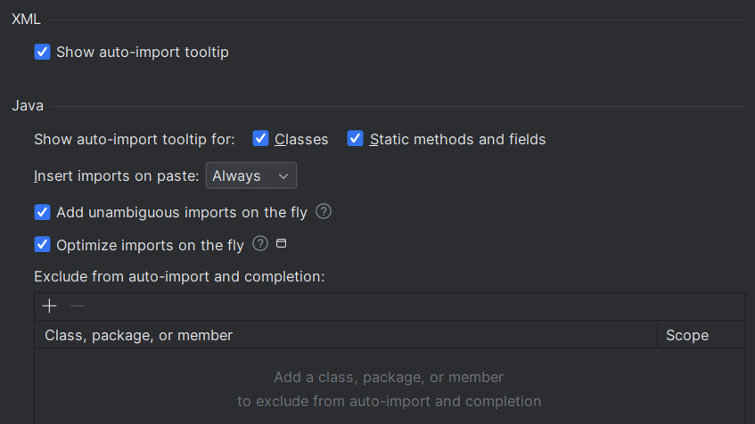
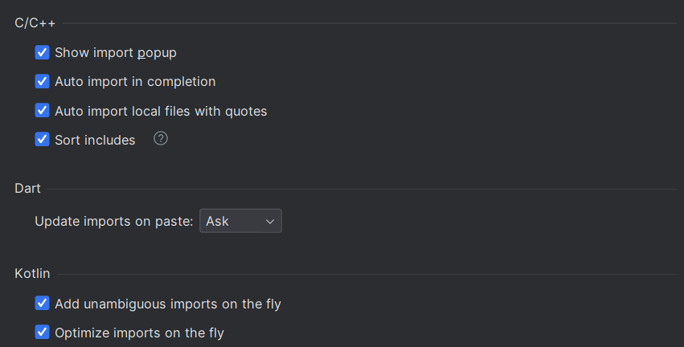
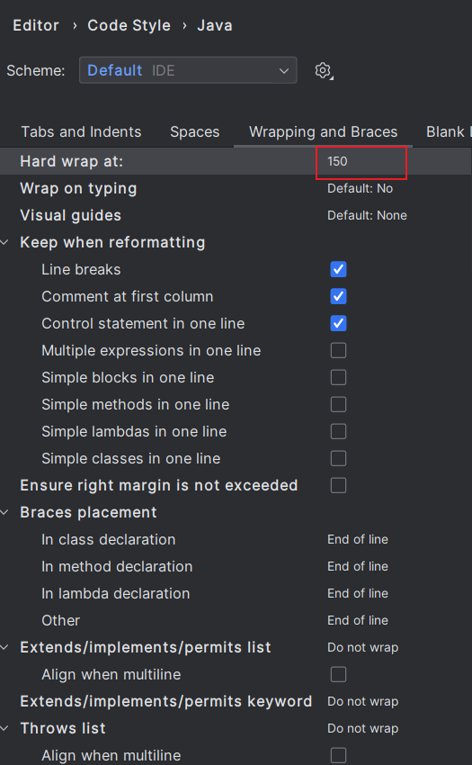
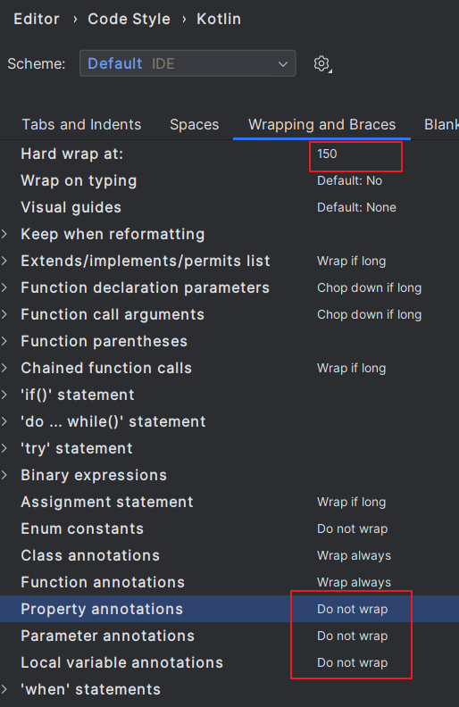
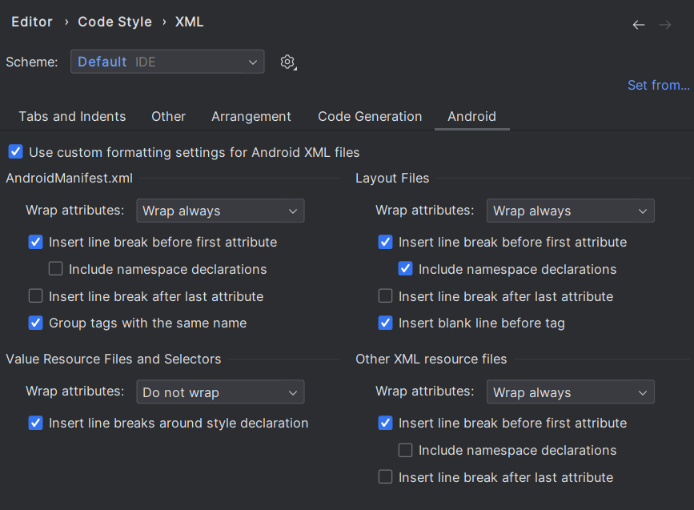
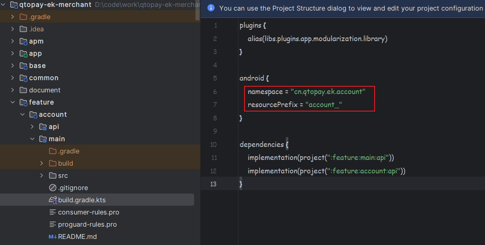

# Coding Standards

To maintain code consistency across this project, please configure your Android Studio settings after opening the project. These settings will only apply to this project.

## 1 Android Studio Settings

### 1.1 Enable Auto-Import

**Settings → Editor → General → Auto Import**:

- ✅ Check "Add unambiguous imports on the fly"
- ✅ Check "Optimize imports on the fly"

### 1.2 Configure Line Length and Wrapping Rules

**Settings → Editor → Code Style → Kotlin**:

- Set "Right margin (columns)" to your preference (recommended: 120-140)
- Configure wrapping and hard wrap rules for consistency

### 1.3 Configure XML Style

**Settings → Editor → Code Style → XML**:

- Set line length and formatting rules
- Ensure consistent XML indentation across the project

## 2 Code Standards

1. **Format code before committing**
   - Use Android Studio's code formatter (Ctrl/Cmd + Alt/Option + L)
   - Ensure consistent indentation and spacing

2. **Minimize visibility** (private → internal → public)
   - **Module-level privacy**: Keep module-private code within the module. Only move code to common modules when it's truly shared across multiple modules
   - **Declaration-level privacy**: Use the most restrictive visibility modifier possible:
     - Prefer `private` for implementation details
     - Use `internal` for module-level APIs
     - Only use `public` for APIs that must be accessible from other modules

## 3 Resource Conventions

### 3.1 Resource Placement

- **Images**: Place in `drawable/` directories (not `mipmap/`, except for launcher icons as per [official guidelines](https://developer.android.com/guide/topics/resources/drawable-resource))
- **Icons**: Use `xxhdpi` density for icon resources (320 dpi)
- **Module resources**: Keep module-private resources within the module directory
- **Common resources**: Only place truly shared resources in common modules

**Rationale**: This follows Android best practices and keeps resources close to their usage, improving modularity and build performance.

### 3.2 Resource Prefixes

Each module has a **unique resource prefix** configured in its `build.gradle.kts` file. All resources within a module must start with this prefix.

**Examples**:

- `home_` for home feature resources
- `account_` for account feature resources
- `common_` for common module resources

**Important**: This prefix requirement applies to **all resource types**, including:

- Strings (`home_title`, `account_error_message`)
- IDs (`home_recycler_view`, `account_login_button`)
- Styles (`home_Theme`, `account_ButtonStyle`)
- Drawables (`home_icon`, `account_background`)
- Dimensions, colors, arrays, etc.

**Benefits**:

- Prevents resource name conflicts between modules
- Makes resource ownership explicit
- Improves code navigation and understanding
- Enables non-transitive R class feature (AGP 8.0+)

## 4 Additional Guidelines

### 4.1 Naming Conventions

- **Classes**: PascalCase (e.g., `AccountRepository`, `LoginViewModel`)
- **Functions**: camelCase (e.g., `pwdLogin()`, `getUserData()`)
- **Variables**: camelCase (e.g., `userName`, `isLoggedIn`)
- **Constants**: UPPER_SNAKE_CASE for compile-time constants (e.g., `MAX_RETRY_COUNT`, `DEFAULT_TIMEOUT`)
- **Private properties**: Consider prefixing with underscore when backing a public property (e.g., `_loginState`)

### 4.2 File Organization

- **Package structure**: Follow feature-based modularization
- **File naming**: Match file name with primary class name
- **Limit file length**: Consider splitting files over 500 lines
- **Keep classes focused**: Single Responsibility Principle

### 4.3 Documentation

- **Public APIs**: Add KDoc comments for all public functions and classes
- **Complex logic**: Add inline comments explaining non-obvious implementations
- **TODO comments**: Use sparingly and reference issues when possible

### 4.4 Git Commit Guidelines

- **Format code** before committing
- **Write meaningful commit messages**:
  - Use conventional commits: `feat:`, `fix:`, `docs:`, `refactor:`, `test:`, `chore:`
  - Example: `feat(account): add biometric login support`
- **Keep commits atomic**: One logical change per commit
- **Review changes** before pushing

## 5 Enforcement

While these standards are primarily guidelines, following them consistently:

- Improves code readability and maintainability
- Reduces merge conflicts
- Facilitates code reviews
- Enables safer refactoring
- Maintains project quality at scale

**Note**: Consider adding pre-commit hooks or CI checks to enforce formatting and basic standards automatically.
