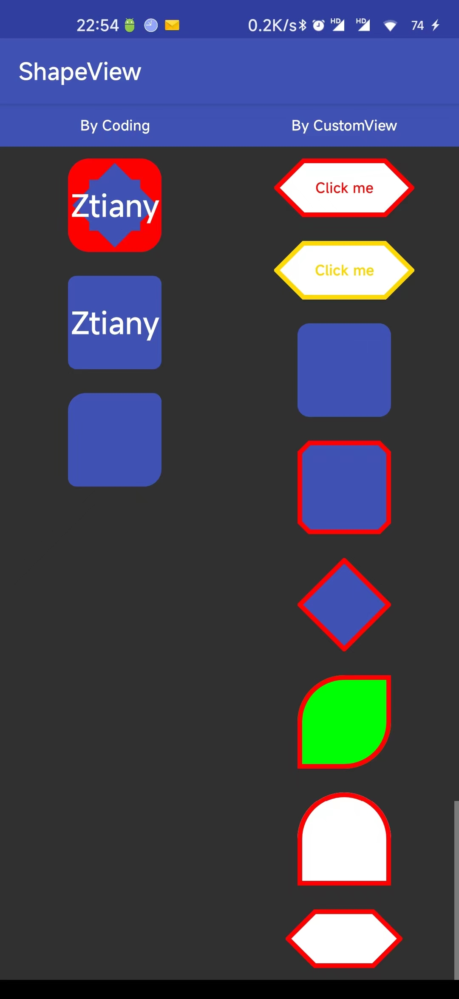

# Android 端技术框架

这是基于 [android-architecture-practice](https://github.com/Ztiany/android-architecture-practice) 开发的基础架构，首先请确保当前系统满足项目的编译环境要求：

- JDK 11
- Android Studio Jellyfish or Newer

下面对整体结构已经相关功能进行介绍。

## 1 整体设计

### 1.1 组件划分

组件划分结构图：


base 中的模块是与业务无关的基础模块：

- activity
- adapter
- fragment
- core
- utils
- view
- viewbinding

common 中的模块是针对 APP 的具体业务与设计风格进行的封装：

- api
- ui
- core

feature 中的是具体的业务模块，目前有：

- account：账号模块，实现登录等相关业务。
- main：主模块，实现首页 table 以及其他功能的跳转。

每个业务 feature 至少有两个子模块，分别是 api 和 main，api 子模块是该 feature 对外暴露的接口和能力，main 子模块是该 feature 的的核心实现，并且实现了 api 子模块中的接口。其他的 feature 通过 api 子模块中定义的接口访问该 feature 的能力。

### 1.2 依赖注入（Ioc 容器）

一个 Android 应用最基本的就是 Activity 和 Fragment 等组件，我们使用这些原生组件来创建不同的应用，但是如果没有云端数据，那么这个应用就是死的，所以  Activity 和 Fragment 等组件就需要 Presenter 或 ViewModel 对象了（同样 Presenter 或 ViewModel 还需要依赖其他具体功能），那么如何让 Activity 和 Fragment 等组件持有这些对象呢？最直接的方法就是直接在 Activity 和 Fragment 等组件中 new 出来，但是这样不仅使程序变得复杂，还产生了强耦合了，即 Activity 和 Fragment 等组件需要关心 Presenter 或 ViewModel 是怎么创建的，而且它们依赖的也是具体的  Presenter 或 ViewModel。

这样做扩展性不够好，程序不够灵活，所以需要把 Presenter 或 ViewModel 等扩展的创建抛出去， Activity 和 Fragment 等组件只关心怎么使用它们，而不需要关心怎么创建它们，因此项目将会采用全局依赖注入技术，将对象交给容器，由容器来处理对象之间的依赖关系。即容器中的对象有什么样的功能，那么容器就具有什么样的功能。

本项目中，小到某个模块展示层中  Fragment/Activity  对 ViewModel 或 Repository 的依赖，大到各模块之间的依赖，都是通过 hilt 依赖注入框架来组织和管理的。

### 1.3 模块通信

待补充

## 2 基础能力

### 2.1 网络请求

首先定义 API 接口：

```kotlin
interface AccountApi {

    // novaAccountLogin 就是 bizCode
    @POST("novaAccountLogin")
    suspend fun pwdLogin(@Body loginRequest: LoginRequest): ApiResult<LoginResponse>

}
```

定义一个 Hilt 模块来提供 AccountApi 的实现：

```java
@Module
@InstallIn(ActivityRetainedComponent.class)
public class AccountInjectionModule {

    @Provides
    static ServiceContext<AccountApi> provideAccountApi(ApiServiceFactoryProvider apiServiceFactoryProvider) {
        return apiServiceFactoryProvider.getDefault().createServiceContext(AccountApi.class);
    }

}
```

在 Repository 中使用 ServiceAPI：

```kotlin
class AccountRepository @Inject constructor(
    private val accountApi: ServiceContext<AccountApi>,
    private val userManager: UserManager,
    private val dispatcherProvider: DispatcherProvider,
) {

    /**
     * - [account] 账号（即手机号）。
     * - [password] 密码。
     */
    suspend fun pwdLogin(account: String, password: String): User {
        val loginRequest = LoginRequest(
            userAccount = account,
            pwd = password,
            validateCode = "",
            loginType = LOGIN_TYPE_NORMAL
        )

        val loginResponse = withContext(dispatcherProvider.io()) {
            accountApi.executeApiCall { pwdLogin(loginRequest) }
        }

        userManager.updateUser {
            it.copy(
                isFirstLogin = loginResponse.firstLoginFlag.isPositiveApiFlag(),
                merchantList = loginResponse.merInfoList.map { merchant ->
                    Merchant(
                        merchantId = merchant.merchantId,
                        merchantName = merchant.merchantName
                    )
                }
            )
        }

        return userManager.user
    }

}
```

ServiceContext 有以下方法：

```kotlin
// 调用 API，拿到一个 CallResult，通过 CallResult 可以拿到请求结果。
suspend fun <T : Any> apiCall(
    call: suspend Service.() -> Result<T>
): CallResult<T>

// 调用 API，直接拿到实体，如果请求失败则会抛出异常
suspend fun <T : Any> executeApiCall(
    call: suspend Service.() -> Result<T>
): T

// 同 apiCall，但是允许服务器返回 {code:0, msg:"xxx", data: null} 的情况，即允许data 为 null。
suspend fun <T : Any?> apiCallNullable(
    call: suspend Service.() -> Result<T>?
): CallResult<T?>

// 同 executeApiCall，允许 data 为空
suspend fun <T : Any?> executeApiCallNullable(
    call: suspend Service.() -> Result<T>?
): T?

// 下面方法支持传入 RetryDeterminer，来定制单个接口的失败自动重试。

suspend fun <T : Any> apiCallRetry(
    retryDeterminer: RetryDeterminer,
    call: suspend Service.() -> Result<T>
): CallResult<T>

suspend fun <T : Any> executeApiCallRetry(
    retryDeterminer: RetryDeterminer,
    call: suspend Service.() -> Result<T>
): T

suspend fun <T : Any?> apiCallRetryNullable(
    retryDeterminer: RetryDeterminer,
    call: suspend Service.() -> Result<T>?
): CallResult<T?>

suspend fun <T : Any?> executeApiCallNullable(
    retryDeterminer: RetryDeterminer,
    call: suspend Service.() -> Result<T>?
): T?

```

最后是在 ViewModel 中调用 Repository 中的能力：

```kotlin
@HiltViewModel
class PasswordLoginViewModel @Inject constructor(
    private val accountRepository: AccountRepository,
    private val appSettings: AppSettings,
) : ViewModel() {

    private val _loginState = MutableLiveData<StateD<User>>()
    val loginState: LiveData<StateD<User>>
        get() = _loginState

    val agreeWithUserProtocol: Boolean
        get() = appSettings.agreeWithUserProtocol

    fun smsLogin(phone: String, password: String) {
        _loginState.setLoading()

        viewModelScope.launch {
            try {
                val user = accountRepository.pwdLogin(phone, password)
                _loginState.setData(user)
                appSettings.agreeWithUserProtocol = true
            } catch (e: Exception) {
                // 调用 ensureActive，保证协程能正常取消
                ensureActive()
                _loginState.setError(e)
            }
        }
    }

}
```

如果使用 apiCall 系列，则按照如下方式处理结果：

```kotlin
private interface TestAPI {
    
    suspend fun getData(): HttpResult<User>

}

private suspend fun test1(serviceContext: ServiceContext<TestAPI>) {
    serviceContext.apiCall {
        getData()
    }.onSuccess { 
        
    }.onError { 
        
    }
}
```

apiCall 与 executeApiCall 没有本质区别，只是处理调用结果的方式不同而已。

### 2.2 数据存储

使用 `com.app.base.data.storage.StorageManager`，可以通过 StorageManager 创建一个 Storage，Storage 可以存储各种类型的数据。

比如：

```kotlin
@Singleton
internal class UserManagerImpl @Inject constructor(
    @ApplicationScope private val coroutineScope: CoroutineScope,
    storageManager: StorageManager,
) : UserManager {

    companion object {
        private const val APP_USER_KEY = "app_user_key"
        private const val APP_USER_STORAGE_ID = "app_user_storage_id"
    }

    private val userFlow: MutableStateFlow<User>

    private val userStorage = storageManager.newStorage(APP_USER_STORAGE_ID)
    
    init {
        val loadedUser = userStorage.getEntity(APP_USER_KEY) ?: User.NOT_LOGIN
  
        userFlow = MutableStateFlow(loadedUser)

        coroutineScope.launch {
            userFlow.onEach {
                if (it != User.NOT_LOGIN) {
                    userStorage.putEntity(APP_USER_KEY, user)
                }
                ifOpenLog {
                    Timber.w("new user: ${JsonUtils.toJson(user)}")
                }
            }.collect()
        }
    }
    
}
```

Storage 有如下能力：

```java
public interface Storage {

    ///////////////////////////////////////////////////////////////////////////
    // Putting
    ///////////////////////////////////////////////////////////////////////////
    void putInt(@NonNull String key, int value);

    void putLong(@NonNull String key, long value);

    void putBoolean(@NonNull String key, boolean value);

    void putString(@NonNull String key, @Nullable String value);

    void putEntity(@NonNull String key, @Nullable Object entity, long cacheTime);

    void putEntity(@NonNull String key, @Nullable Object entity);

    SharedPreferences.Editor edit();

    ///////////////////////////////////////////////////////////////////////////
    // Getting
    ///////////////////////////////////////////////////////////////////////////
    int getInt(@NonNull String key, int defaultValue);

    long getLong(@NonNull String key, long defaultValue);

    boolean getBoolean(@NonNull String key, boolean defaultValue);

    @Nullable
    String getString(@NonNull String key);

    @NonNull
    String getString(@NonNull String key, @NonNull String defaultValue);

    /**
     * @param key  缓存的 key
     * @param type 缓存实体类型，如果是泛型类型，请使用 {@link TypeFlag}标识
     * @param <T>  缓存实体类型
     * @return 缓存
     */
    @Nullable
    <T> T getEntity(@NonNull String key, @NonNull Type type);

    /**
     * @param key  缓存的 key
     * @param type 缓存实体类型，如果是泛型类型，请使用 {@link TypeFlag}标识
     * @param <T>  缓存实体类型
     * @return 缓存
     */
    @NonNull
    <T> T getEntity(@NonNull String key, @NonNull Type type, @NonNull T defaultValue);

    ///////////////////////////////////////////////////////////////////////////
    // remove
    ///////////////////////////////////////////////////////////////////////////

    void remove(@NonNull String key);

    void clearAll();

}
```

Storage  底层的实现有：

- SP
- MMKV

大部分情况下使用 SP 就满足需求，特别是存储用户信息，请务必使用 SP，因为 MMKV 在数据罗盘时是没有备份机制的，有一定几率导致文件损坏，从而所有数据全部丢失。

### 2.3 基类介绍

该项目只对 Fragment 做了封装，因为 Activity 可以直接使用 Fragment 作为 UI 实现，同时对封装 Activity 和 Fragment 进行封装显得多余。

#### 2.3.1 BaseUIFragment

封装最常见的 UI 能力，比如展示 Toast 和 LoadingDialog。使用：

```kotlin
class ComponentFragment : BaseUIFragment<SampleFragmentComponentBinding>() {

    // 请在 onSetUpCreatedView 初始化 UI
    override fun onSetUpCreatedView(view: View, savedInstanceState: Bundle?) = withVB {
        sampleTvDialogConfirm.onDebouncedClick {
            sampleConfirmDialog()
        }
    }

    private fun sampleConfirmDialog() {
        showConfirmDialog {
            message = "我是一个确认框"
            negativeText = "取消"
            positiveText = "确认"
            positiveListener = {

            }
            cancelableTouchOutside = false
        }
    }

}
```

#### 2.3.2 BaseStateFragment

相比 BaseUIFragment，其多了一个状态页能力。其对布局有一定的要求：

```xml
<?xml version="1.0" encoding="utf-8"?>
 <--> 提供 SimpleMultiStateLayout 以支持下拉刷新（可选），id 必须为 base_refresh_layout </-->
<com.android.base.fragment.widget.ScrollChildSwipeRefreshLayout
    xmlns:android="http://schemas.android.com/apk/res/android"
    style="@style/Widget.App.SwipeRefreshLayout">

    <--> 必须提供 SimpleMultiStateLayout，且 id 必须为 base_state_layout </-->
    <com.android.base.fragment.widget.SimpleMultiStateLayout style="@style/Widget.App.SimpleMultiStateLayout">

        <androidx.recyclerview.widget.RecyclerView
            android:id="@id/recycler_view"
            android:layout_width="match_parent"
            android:layout_height="match_parent" />

    </com.android.base.fragment.widget.SimpleMultiStateLayout>

</com.android.base.fragment.widget.ScrollChildSwipeRefreshLayout>


```

#### 2.3.2 BaseListFragment

BaseListFragment 以及其他 List 系列的 Fragment，用于帮助我们开始实现一个列表页。

## 3 展示层能力

展示层架构即子模块内部如何组织 UI 与业务逻辑的交互。比如 MVP、MVVM 以及 MVI 都是一种展示层架构。

### 3.1 处理简单网络请求

上面对网络请求做了说明，下面来说一下任何将请求结果分发到 UI 层。

我们通常在 ViewModel 中调用 Repository，然后将请求结果以 LiveData 或者是 Flow 的形式暴露给 Activity/Fragment。

一个网络请求是生命周期是从 Loading 到 Complete，而 Complete 可以能是 Success 或者是 Failed，因此项目中提供了一个 State 类来描述请求状态，分别是：

- Loading
- Error
- Success

我们可以将 State 放入到 LiveData 或者是 Flow 中，然后 Activity/Fragment 对状态进行订阅以触发 UI 更新。

对于到底是使用 LiveData 还是 Flow，该项目没有强制要求，且都提供了封装，下面进行介绍。

**1 LiveData**：

在 ViewModel 中定义 LiveData：

```kotlin
@HiltViewModel
class PasswordLoginViewModel @Inject constructor(
    private val accountRepository: AccountRepository,
    private val appSettings: AppSettings,
) : ViewModel() {

    private val _loginState = MutableLiveData<StateD<User>>()
    val loginState: LiveData<StateD<User>>
        get() = _loginState

    val agreeWithUserProtocol: Boolean
        get() = appSettings.agreeWithUserProtocol

    fun smsLogin(phone: String, password: String) {
        // 设置为 loading 状态
        _loginState.setLoading()

        viewModelScope.launch {
            try {
                val user = accountRepository.pwdLogin(phone, password)
                // 成功，则设置数据
                _loginState.setData(user)
                appSettings.agreeWithUserProtocol = true
            } catch (e: Exception) {
                ensureActive()
                // 失败则设置异常
                _loginState.setError(e)
            }
        }
    }

}
```

在 Fragment 处理：

```kotlin
@AndroidEntryPoint
class PasswordLoginFragment : BaseUIFragment<AccountFragmentPasswordBinding>() {

    private val viewModel: PasswordLoginViewModel by viewModels()

    @Inject lateinit var navigator: AccountInternalNavigator

    override fun onCreate(savedInstanceState: Bundle?) {
        super.onCreate(savedInstanceState)
        // 因为是使用 LiveData，所以直接在 onCreate 中就可以订阅
        subscribeViewModel()
    }

    override fun onSetUpCreatedView(view: View, savedInstanceState: Bundle?) {
        super.onSetUpCreatedView(view, savedInstanceState)
        setUpListeners()
        setUpAgreement()
    }

    private fun setUpAgreement() {

    }

    private fun setUpListeners() {
        vb.accountBtnLogin.onDebouncedClick {
            doLoginChecked()
        }
    }

    private fun doLoginChecked() {
        if (validateCellphone(vb.accountEtPhone) && validatePassword(vb.accountEtPassword) && checkAgreement()) {
            viewModel.smsLogin(vb.accountEtPhone.textValue(), vb.accountEtPassword.textValue())
        }
    }

    private fun checkAgreement(): Boolean {
        return true
    }

    private fun subscribeViewModel() {
        // 调用 handleLiveData 来处理调用
        handleLiveData(viewModel.loginState) {
            // onData 表示成功，并且拿到了数据
            onData {
                Timber.d("Login Succeeded: $it")
                showMessage(com.app.base.ui.R.string.login_success)
                navigator.exitAndToHomePage()
            }
        }
    }

}
```

handleLiveData 提供了非常多的接口，基本上可以满足各种需求：

```kotlin
/** Configure how to handle UI state [State]. */
class ResourceHandlerBuilder<L, D, E> {

    internal var onLoading: ((step: L?) -> Unit)? = null
    internal var onLoadingEnd: (() -> Unit)? = null
    internal var onIdle: (() -> Unit)? = null

    internal var onError: ((error: Throwable, reason: E?) -> Unit)? = null
    internal var onSuccess: ((D?) -> Unit)? = null
    internal var onData: ((D) -> Unit)? = null
    internal var onNoData: (() -> Unit)? = null

    internal var onErrorState: ((error: Throwable, reason: E?) -> Unit)? = null
    internal var onSuccessState: ((D?) -> Unit)? = null
    internal var onDataState: ((D) -> Unit)? = null
    internal var onNoDataState: (() -> Unit)? = null

    internal var loadingMessage: CharSequence = ""
    internal var showLoading: Boolean = true
    internal var forceLoading: Boolean = true

    /** [onLoadingWithStep] will be called once state is [Loading]. */
    fun onLoadingWithStep(onLoading: ((step: L?) -> Unit)? = null) {
        this.onLoading = onLoading
    }

    /** [onLoading] will be called once state is [Loading]. */
    fun onLoading(onLoading: (() -> Unit)? = null) {
        onLoadingWithStep {
            onLoading?.invoke()
        }
    }

    /** [onLoadingEnd] will be called once state is not [Loading].. */
    fun onLoadingEnd(onLoadingEnd: (() -> Unit)? = null) {
        this.onLoadingEnd = onLoadingEnd
    }

    /** [onError] will be called when [State] is [Error] and is not handled. It behaves like an event. */
    fun onError(onErrorEvent: ((error: Throwable) -> Unit)? = null) {
        onErrorWithReason { error, _ -> onErrorEvent?.invoke(error) }
    }

    /** [onErrorEventWithReason] will be called when [State] is [Error] and is not handled. It behaves like an event. */
    fun onErrorWithReason(onErrorEventWithReason: ((error: Throwable, reason: E?) -> Unit)? = null) {
        this.onError = onErrorEventWithReason
    }

    /** [onErrorState] will be called once [State] is [Error]. */
    fun onErrorState(onErrorState: ((error: Throwable) -> Unit)? = null) {
        onErrorStateWithReason { error, _ -> onErrorState?.invoke(error) }
    }

    /** [onErrorStateWithReason] will be called once [State] is [Error]. */
    fun onErrorStateWithReason(onErrorStateWithReason: ((error: Throwable, reason: E?) -> Unit)? = null) {
        this.onErrorState = onErrorStateWithReason
    }

    /** [onSuccess] will always be called when [State] is [Success] and is not handled. It behaves like an event. */
    fun onSuccess(onSuccessEvent: ((D?) -> Unit)? = null) {
        this.onSuccess = onSuccessEvent
    }

    /** [onData] will be called only when [State] is [Data] and is not handled. It behaves like an event. It behaves like an event. */
    fun onData(onDataEvent: ((D) -> Unit)? = null) {
        this.onData = onDataEvent
    }

    /** [onNoData] will be called only when [State] is [NoData] and is not handled. It behaves like an event. */
    fun onNoData(onNoDataEvent: (() -> Unit)? = null) {
        this.onNoData = onNoDataEvent
    }

    /** [onSuccessState] will always be called once [State] is [Success]. */
    fun onSuccessState(onSuccessState: ((D?) -> Unit)? = null) {
        this.onSuccess = onSuccessState
    }

    /** [onDataState] will be called only when [State] is [Data]. */
    fun onDataState(onDataState: ((D) -> Unit)? = null) {
        this.onData = onDataState
    }

    /** [onDataState] will be called only when [State] is [NoData]. */
    fun onNoDataState(onNoDataState: (() -> Unit)? = null) {
        this.onNoData = onNoDataState
    }

    /** when [State] is [Loading], what to show on the loading dialog. */
    fun loadingMessage(loadingMessage: CharSequence) {
        this.loadingMessage = loadingMessage
    }

    /** indicate whether the loading dialog should be showing when [State] is [Loading]. */
    fun disableLoading() {
        showLoading = false
    }

    /** indicate whether the loading dialog is cancelable. */
    fun forceLoading() {
        this.forceLoading = true
    }

}
```

**2 使用 Flow**：

在 Fragment 中订阅 Flow：

```kotlin
@AndroidEntryPoint
class PhonePreviewsFragment : BaseStateFragment<MainFragmentPhonePreviewsBinding>() {

    private val phoneViewModel by activityViewModels<PhoneViewModel>()

    override fun onSetUpCreatedView(view: View, savedInstanceState: Bundle?) {
        stateLayoutConfig
            .setStateIcon(EMPTY, R.drawable.main_img_no_device)
            .setStateMessage(EMPTY, "还没有云手机哦~")
            .setStateAction(EMPTY, getString(R.string.refresh))
    }
    
    // 因为是使用 Flow，则应该在 onViewPrepared 中订阅。
    protected open fun onViewPrepared(view: View, savedInstanceState: Bundle?) {
        subscribeViewModel()
    }

    private fun subscribeViewModel() {
        // 使用 handleFlowWithViewLifecycle 来处理，接口与 handleLiveData 中的一致。
        handleFlowWithViewLifecycle(data = phoneViewModel.devicesState) {
     
        }
    }

}
```

### 3.2 实现状态页

### 3.3 实现列表页

#### 3.3.1 分段式

参考 sampl 模块，文档待补充。

#### 3.3.2 epoxy

参考 sampl 模块，文档待补充。

#### 3.3.3 paging3

参考 sampl 模块，文档待补充。

## 4 UI 组件介绍

### 4.1 关于 Drawable

本项目继承了一个 [android-drawable-view](https://github.com/Ztiany/android-drawable-view) 库，你可以通过 View 的属性来实现下面展示的 Drawable，因此对于一般的常见需求，你不需要在编写 drawable xml 了：

ShapeableView 系列（不支持渐变）：



DView 系列（支持渐变）：


### 4.2 对话框封装

参考下面代码：

```kotlin
class ComponentFragment : BaseUIFragment<SampleFragmentComponentBinding>() {

    override fun onSetUpCreatedView(view: View, savedInstanceState: Bundle?) = withVB {
        sampleTvDialogConfirm.onDebouncedClick {
            sampleConfirmDialog()
        }
    }

    private fun sampleConfirmDialog() {
        showConfirmDialog {
            message = "我是一个确认框"
            negativeText = "取消"
            positiveText = "确认"
            positiveListener = {

            }
            cancelableTouchOutside = false
        }
    }

}
```

> 目前样式还没有调整，后续会调整。

## 5 构建说明

### nonTransitiveRClass

Android Gradle Plugin 8.0 默认开启 nonTransitiveRClass。一个模块引用另一个模块的资源，必须使用全路径名。

###  namespace

Android Gradle Plugin 8.0  开始，使用 `namespace` 来指定该模块 R 文件所谓报名，Manifest 文件中不再需要指定 `package name`。

