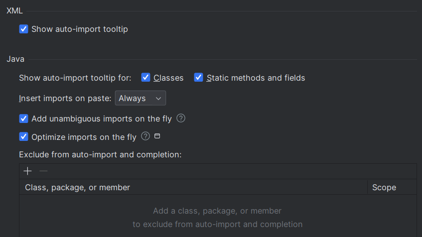
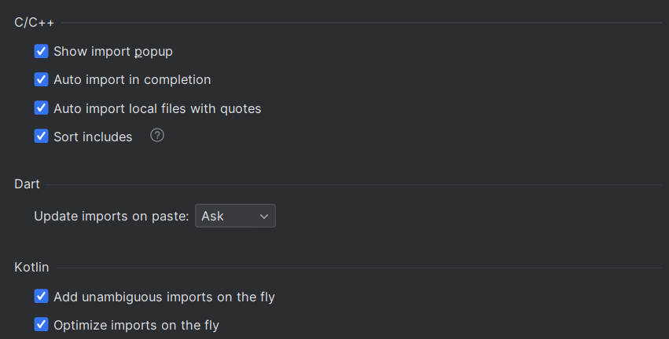
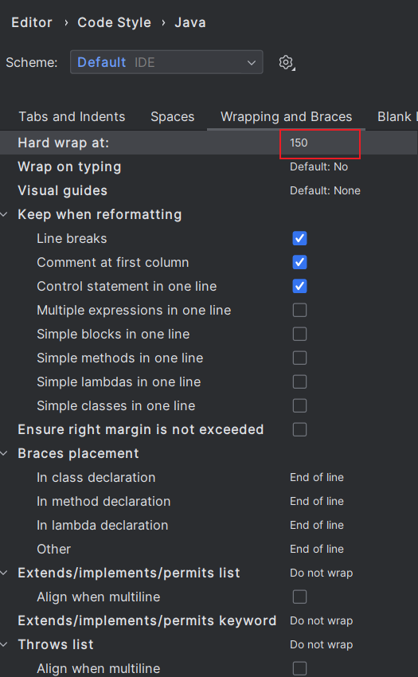
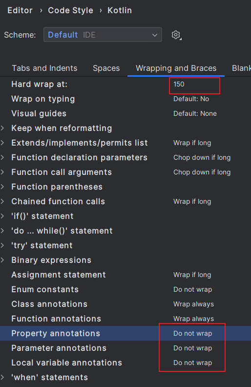
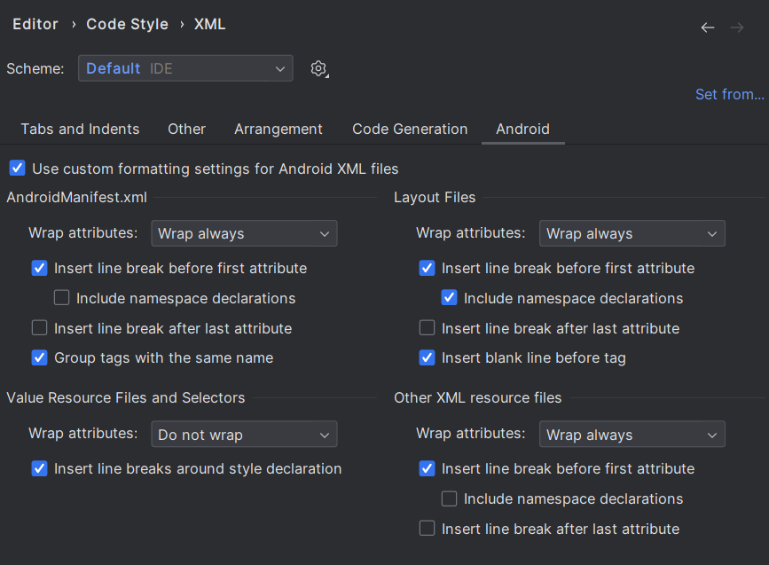
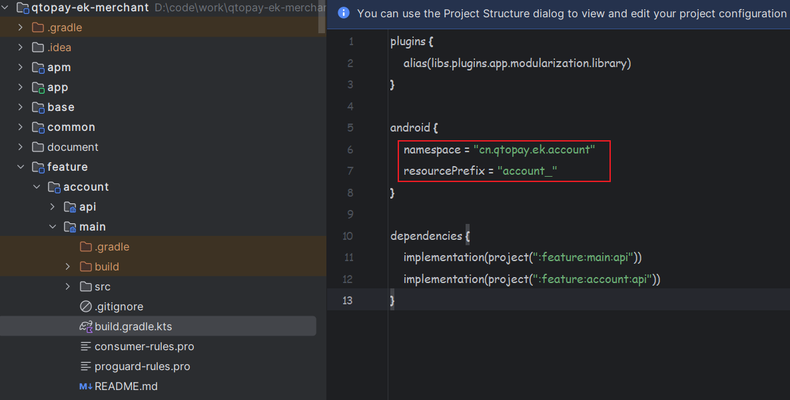

# 编码规范

## 1 AndroidStudio 设置

未来保持统一，请打开一下设置（打开项目后进行设置，那么设置仅对向前项目生效）。

**1 打开自动导入**：

**2 统一行的长度和换行规则**：

**3 统一XML Style**：

## 2 代码规范

1. 提交代码前请格式化；
2. 保证代码最小可见性：
   1. 模块私有的就一定放到该模块内部，不允许其他模块访问，确定是公用的才放到公共模块中；
   2. 能 private 就 private，然后是 internal，最后才考虑 public。

## 3 资源规范

**1 资源放置位置**：

- 【官方建议】图片放到 drawable 中，mipmap 只放启动图标。
- 图标资源使用 xxhdpi 级别的。
- 模块内私有的图片资源就放到模块内，公共的资源才放到公共模块。

**2 模块资源前缀**：

因此模块内的任何资源包括 Style 都必须以该模块的前缀开头。
